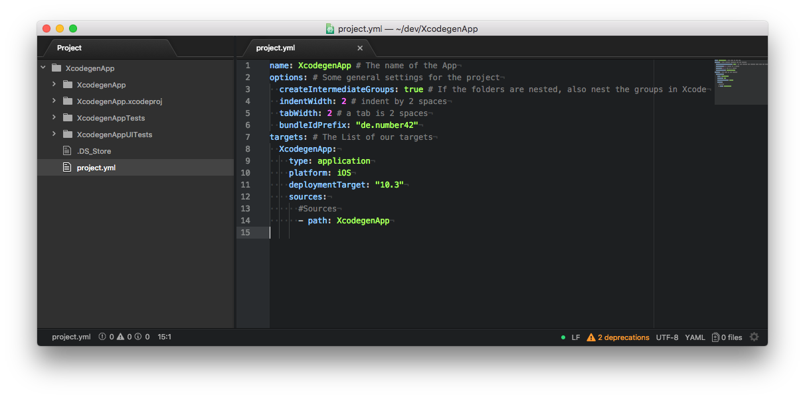
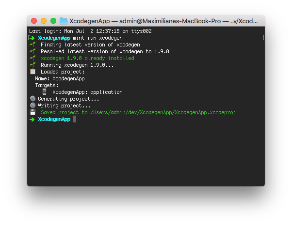
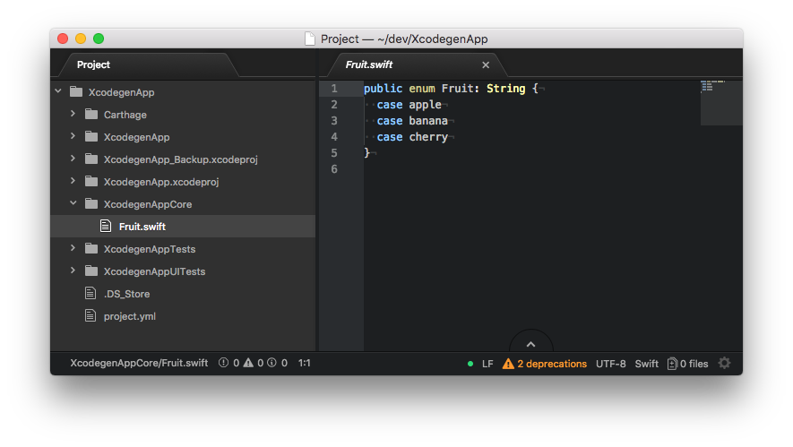
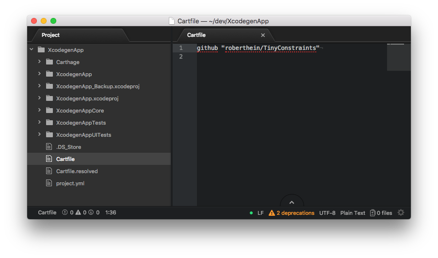
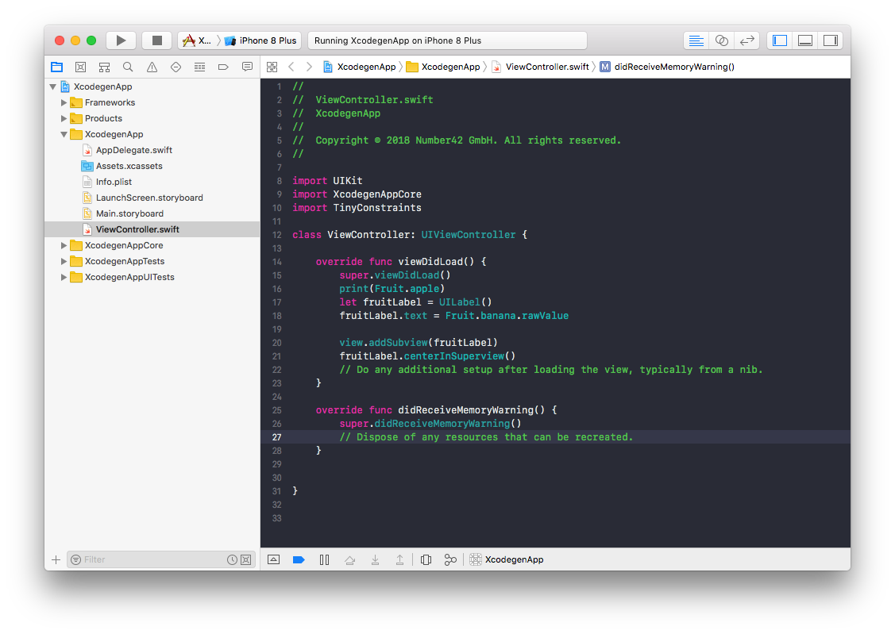

_June 11, 2018, by [Wolfgang Lutz](https://number42.de/#team)_

# Getting (nearly) rid of Xcodeproject - A (not so) short Introduction to Xcodegen

## What is the problem with xcodeprojects?

`Xcode` uses a project file, the `.xcodeproj` file, to bundle source code and resources for the IDE and build tools to digest. Though this works quite well most of the time, it has some downsides:

- Though you can manually resolve merge conflicts in this file, e.g. if source code files or resources have been added on different branches, you can never be sure if the file is correct afterwards.
- Syncing the folder structure on disk and the group structure in the project is mainly a manual process that sometimes leads to confusion. There already are tools to mitigate this, like `synx` or the sort functionality of the `xcodeproj` gem.
- Xcode does not warn you when a file is missing until you compile.
- Orchestrating dependencies and build scripts of multiple targets can become quite a hassle.

## Introducing Xcodegen

Xcodegen is a tool, that allows us to generate the xcodeproj file from a definition in a file called project.yml. As the xcodeproj file can be generated whenever we like, we do not even have to keep it inside our git and can ignore it (though I personally prefer to keep it checked in, so I can see what changes my edits to the project.yml file introduced to the project).

Here are the two most important features of Xcodegen:

-   You can define every kind of Xcode target (application, frameworks etc.) for all sorts of platforms (iOS, tvOS, macOS, watchOS) this way.
-   it also allows to connect a folder of source files to a target, making it easier to manage which source code files are contained in which target.

Though `xcodegen` is still quite a young project, it already can do a lot. Sometimes, you have to find workarounds for something, but the author is quite active on github and bugs are oftenly fixed only hours after reporting them. A big thanks for that!

## How to install xcodegen

Amongst other methods of installation, you can install xcodegen using brew, by running

```bash
brew tap yonaskolb/XcodeGen https://github.com/yonaskolb/XcodeGen.git
brew install xcodegen
```

or, if you are a loyal reader of this series, by using mint

```bash
mint install yonaskolb/xcodegen
```

## Generating an App Project

First, create a new blank Single Page iOS App with `Xcode` to initially get all the necessary `.swift`, `.xcassets` etc. files.

We will now recreate the project using a `project.yml` file.

Leave `Xcode` and create a `project.yml` file with the following content in the root:

```yml
name: XcodegenApp # The name of the App
options: # Some general settings for the project
  createIntermediateGroups: true # If the folders are nested, also nest the groups in Xcode
  indentWidth: 2 # indent by 2 spaces
  tabWidth: 2 # a tab is 2 spaces
  bundleIdPrefix: "de.number42"
targets: # The List of our targets
  XcodegenApp:
    type: application
    platform: iOS
    deploymentTarget: "10.3"
    sources:
      #Sources
      - path: XcodegenApp
```



Then, rename the existing `.xcodeproj` (so that you can have a look at it
and compare). I always just add "Backup" to the name here.

In the terminal, in your project root, run `xcodegen` or `mint run
xcodegen`:



Open the project and run it. You have the same results as before!

"The same results? But what about testing? The tests are gone!" I can
hear you say. Do not worry, we will fix that immediately.

## Generating TestTargets

Add the following target to the project.yml:

```yml
  XcodegenApp-iOS-Tests:
    type: bundle.unit-test
    platform: iOS
    deploymentTarget: "10.3"
    sources:
      - path: XcodegenAppTests
    dependencies:
      - target: XcodegenApp
```

Again, close `Xcode`. (Xcode is a bit peculiar about having changed the
project files while they are open and gets angry sometimes.)

Generate the project, open it and run the tests: voila!

To add UI Tests, add this target:

```yml
  XcodegenApp-iOS-UITests:
    type: bundle.ui-testing
    platform: iOS
    sources:
      - path: XcodegenAppUITests
    dependencies:
      - target: XcodegenApp
```

That's it, a buildable app project with working tests.

## Generating a Framework Project

Let's go a bit deeper now:

Maintaining submodules in Xcode has always been a bit of a hassle.
Introducing modularization into your app is a breeze with `xcodegen`.

To learn how to do this, we create a XcodegenAppCore framework, that
contains the classic fruit enum:

1.  Create a folder "XcodegenAppCore" in the root

2.  Create "Fruit.swift" inside this folder. Add this as content:

    ```swift
    public enum Fruit: String {
      case apple
      case banana
      case cherry
    }
    ```


3.  Add an Info.plist ([this one does the job](https://github.com/num42/RxUserDefaults/blob/master/Supporting%20Files/Info.plist)) to the "XcodegenAppCore" folder.

4.  Add this target to the `project.yml`:

    ```yml
    XcodegenAppCore:
      type: framework
      platform: iOS
      deploymentTarget: "10.3"
      sources:
        - path: XcodegenAppCore
    ```

5.  Add

    ```yml
    dependencies:
        - target: XcodegenAppCore
    ```

    To the "XcodegenApp" target. Close `Xcode`, run `xcodegen`, then run the project. Ok, it's building, but nothing is happening yet.

6. Add

    ```swift
    import XcodegenAppCore
    ```

    to the ViewController and add

    ```swift
    print(Fruit.apple)
    ```

    to the `viewDidLoad()`.

The debug logger now proudly confirms you as the owner of your very own fruit related
framework 🍎 🍌 🍒.

## Adding Dependencies

One great way to handle dependencies on iOS is `carthage`.

`Xcodegen` makes it very easy to manage carthage dependencies, so let's
add roberthein's TinyConstraints as a Layout Library to learn how that's
done:

3.  Run

    ```
    brew install carthage
    ```
2.  Create a file named "Cartfile"

3.  Add

    ```
    github "roberthein/TinyConstraints"
    ```

    to it.

    

4.  Run

    ```bash
    carthage update --platform iOS
    ```

5.  Add this line to your `XcodegenApp` target's dependencies in `project.yml`:

    ```yml
      - carthage: TinyConstraints
    ```

    Close `Xcode`, run `xcodegen`, then run the project.

    You can now use TinyConstraints:

    ```swift
    import TinyConstraints
    ```

    In the viewDidLoad(), add:

    ```swift
    let fruitLabel = UILabel()
    fruitLabel.text = Fruit.banana.rawValue

    view.addSubview(fruitLabel)
    fruitLabel.centerInSuperview()
    ```
    

    Run the project to see TinyConstraints in Action:
    

## Where to go from here?

We will revisit `xcodegen` for another time in the near future and see some more nice tricks, for example how to use `xcodegen` to generate an additional target with special debug features and much more!

Stay tuned!

## Acknowledgments
Thanks to [Yonas Kolb](https://github.com/yonaskolb) for reviewing this article before release and to [Maximiliane Windl](https://number42.de/#team) for testing the tutorial, fixing issues and making screenshots. 
